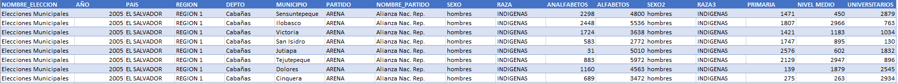

# PROYECTO 2 - BASES DE DATOS 1

# heading 1

## heading 2

### heading 3

#### heading 4

##### heading 5

# PROCESO DE NORMALIZACION

## Tabla base (archivo csv)

# PRIMERA FORMA NORMAL (1FN)

## PAIS

## PARTIDO POLITICO

## MUNICIPIO

## PAIS

## DEPARTAMENTO

## MUNICIPIO

## RESULTADO

# SEGUNDA FORMA NORMAL (2FN)

## DEPARTAMENTO

## ELECCIONES

## MUNICIPIO

## PARTIDO POLITICO

# TERCERA FORMA NORMAL (3FN)

## ELECCIONES

## PARTIDO POLITICO

## RAZA

## SEXO

## RESULTADOS

