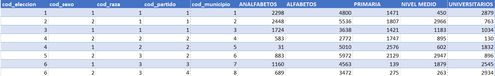

# PROYECTO 2 - BASES DE DATOS 1

# BREVE DESCRIPCIÓN DEL PROYECTO

El Instituto Centroamericano Electoral solicita modelar una base de datos en el cual se puedan almacenar los datos electorales de las elecciones que se han llevado a cabo durante los años 2001 y 2005 para que se puedan realizar reportes y estadisticas sobre los resultados obtenidos para que puedan mostarse a la población de cada país de forma que pueda ser entendible y encontrar patrones de intenciones de voto tomando en cuanta factores como el nivel académico (primaria, secundaria y universitario), genero y raza (Garifuna, ladino o indigena).

# PROCESO DE NORMALIZACION

## Tabla base (archivo csv)

El Instituto Centroamaricano Electoral provee un archivo .csv base el cual contiene todos los datos con los que se debe realizar la normalización del modelo de la base de datos.

Para obtener un modelo de datos óptimo es necesario aplicar las <b>reglas de normalización</b> para garantizar que el modelo entidad relación sea integro y que las consultas a realizar sean lo más sencillo posible.

# PRIMERA FORMA NORMAL (1FN)

Lo que se realizó en la 1FN fue lo siguiente:
<ui>

<li>Lograr que en cada columna existan datos indivisibles</li>
</ui>

Por lo tanto, a partir de la tabla base, mediante un analisis de lo requerido, se pudo determinar las siguientes entidades

## PAIS

Las columnas correspondientes a la tabla pais, en la tabla base son un valor que se repite mucho, por lo cual es importante crear una tabla aparte con su propia llave primaria.

## PARTIDO POLITICO

Analizando la tabla base, se identificó el un valor que se repite y es necesario que una entidad aparte sea creada es la de partido politico, ya que cada país puede tener uno a muchos partidos politicos, por lo cual se organizó por pais a donde pertenece el partido politico (codigo del pais), el nombre completo del partido politico

## DEPARTAMENTO

En la tabla base se analizó que cada pais esta formado por muchos departamentos, y a su vez, el departamento es parte de una región, pero realizando el analisis se determinó que esta tabla tiene que simplificarse.

## MUNICIPIO

En cada departamento existen muchos municipios.

## RESULTADO

Esta es la tabla más compleja de analizar, ya que contiene muchos campos que pueden resultar confusos al momento de modelar, para la 1FN se tomaron los datos
más importantes y que tengan relación con los resultados electorales obtenidos

# SEGUNDA FORMA NORMAL (2FN)

Para obtener la 2FN se hizó lo siguiente:

<ul>
    <li>
        Cada registro de la tabla debe depender de la clave primaria de la tabla a la cual pertenece
    </li>
    <li>
        Garantizar que los datos no se repitan
    </li>
</ul>

## REGION

Analizando la tabla departamento de la 1FN, era posible simplificar más e incluso separar las regiones de los departamentos, quedando de la siguiente forma:

Cada un país tiene muchas regiones, por lo tanto la tabla <b>REGION</b> tiene su propia llave primaria, así como la llave del país al que la región pertenece, por ejemplo si Guatemala tiene como codigo el numero 7 y cuenta con 6 regiones, la tabla region contendrá 6 columnas referentes a este país.

## DEPARTAMENTO

Cada departamento forma parte de una región, por lo tanto la tabla <b> DEPARTAMENTO </b> tiene su propia llave primaria, asi como tambien contiene como llave foranea el codigo de la región a la cual el departamento pertenece.

## ELECCIONES

Observando la tabla <b>RESULTADOS</b> de la 1FN se decidió separar los datos relacionados a las elecciones que se llevaron a cabo. Para este caso los campos de la tabla son: Nombre_eleccion, año de eleccion y tiene su propia llave primaria asi como tambien el codigo de pais, que representa al pais donde se llevaron a cabo las elecciones.

## MUNICIPIO

Para el municipio, unicamente se le asoció el codigo del departamento al cual el municipio en cuestión pertence.

## PARTIDO POLITICO

Parta la tabla <b>PARTIDO POLITICO </b> se decidio asociarlo al país de origen, asi como con su nombre completo y su nombre abreviado.

# TERCERA FORMA NORMAL (3FN)

En la 3FN se buscó lo siguiente:

<ul>
    <li>
        Generar catálogos (para poder diferenciar tipos)
    </li>
    <li>
        Con los catálogos, formar relaciones de muchos a muchos
    </li>
    <li>
        Las llaves que no sean primarias deben ser unicamente foraneas en otras tablas
    </li>
    <li>
        No almacenar valores calculados, es valores que pueden ser obtenidos mediante una consulta
    </li>
</ul>

## ELECCIONES

## PARTIDO POLITICO

## RAZA

Un dato que se encontraba de forma frecuente en la tabla <b>RESULTADOS</b> de la 
de las fases anteriores era la raza, por lo cual decidio generarse una tabla que contiene las razas (Indigena, Ladina, Garifuna) a forma de catálogo, para poder ser identificada facilmente en la tabla de resultados.

## SEXO

De igual forma que en la tabla de raza, el dato "sexo" era muy frecuente en la tabla <b>RESULTADOS</b>, por lo tanto se generó una tabla que contiene el genero de las personas (hombre, mujer) a forma de catálogo. Para que de igual manera sea identificada como llave foranea en la tabla resultados

## RESULTADOS

En la tabla resultados se eliminaron las referencias literales a lo referente al sexo, pais, partido politico, raza y municipio, quedando unicamente los resultados de las elecciones.

